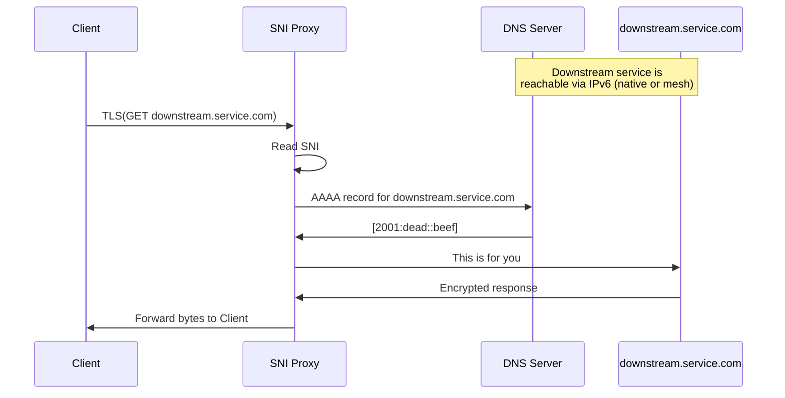

# Reverse proxy for SNI routing.
                                                                                                
## Why?

In an ideal world anyone would be able to host their software. Unfortunately, with IPv4 address
exhaustion and limited adoption of IPv6 infrastructure this is not a reality we live in.
                                                                                                
One way to address the issue would be to host software in public cloud. This, however, means
paying for the infrastructure, and, exposing encryption keys (assuming there is TLS involved) to the public cloud.

If you would like to keep your keys to yourself and minimize the infrastructure bills, another
way to address the issue would be to deploy TCP load balancer in public cloud and use SNI to
chose downstream service.
                                                                                                
## How?

 Mermaid code under spoiler 

## Installation

- [Get rust](https://rustup.rs/)
- Build with `cargo build --bin rpx --features instrument --release`. Alternatively you may cross-compile with `docker buildx` - see `Makefile` for inspiration.  
- Take a look at [`sample_config.yml`](./sample_config.yml), punch in values relevant for your use-case 

## More docs

- Run `cargo doc --open` 
